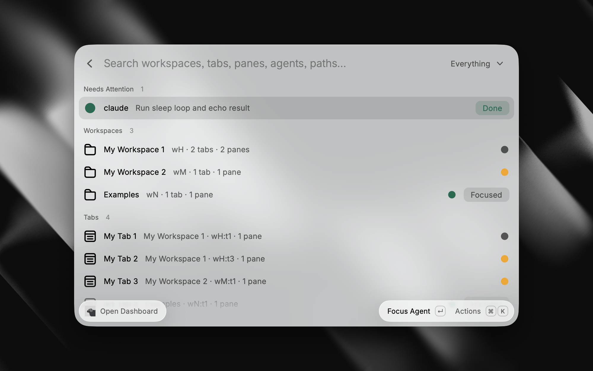
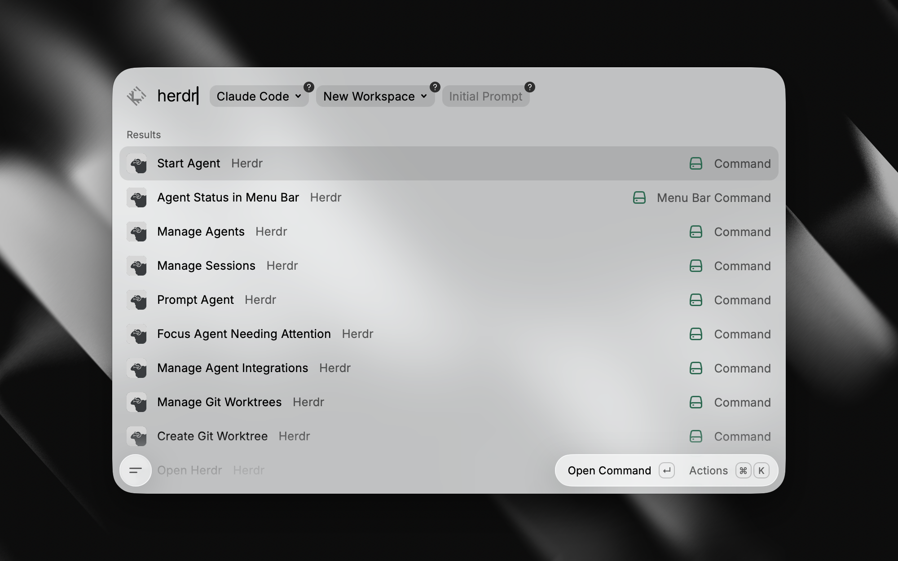
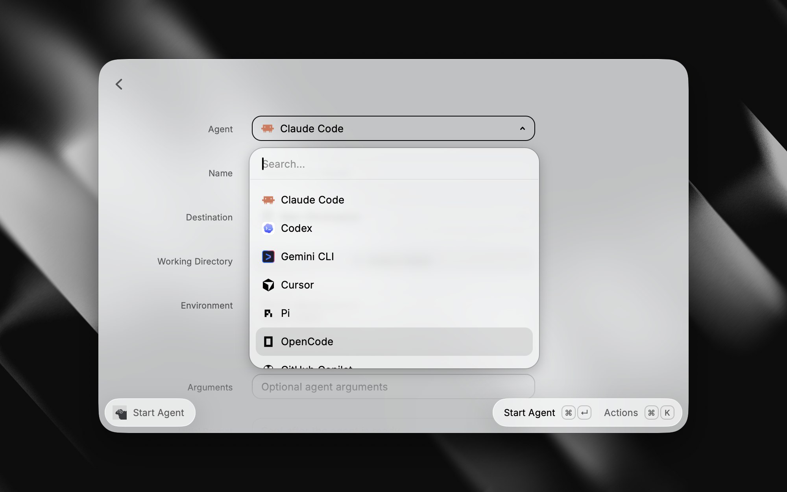

# Herdr for Raycast

Control [Herdr](https://herdr.dev/) workspaces and coding agents from Raycast.



<p>
  
  
</p>

## Features

- Browse and control workspaces, tabs, panes, and agents.
- Start, prompt, inspect, rename, interrupt, and focus agents.
- Save reusable Start Agent configurations as Quicklinks.
- Create workspaces, tabs, splits, and Git worktrees.
- Manage sessions, plugins, and agent integrations.
- Monitor agent status from the menu bar.
- Open the selected resource in your preferred terminal.

## Requirements

- macOS
- [Raycast](https://www.raycast.com/)
- [Herdr](https://herdr.dev/) 0.7 or newer

Install Herdr with Homebrew:

```bash
brew install herdr
```

The extension finds Herdr in `PATH`, `~/.local/bin`, `/opt/homebrew/bin`, and `/usr/local/bin`. You can also set an explicit binary path in its preferences.

## Commands

| Command                       | Purpose                                          |
| ----------------------------- | ------------------------------------------------ |
| Dashboard                     | Browse and control the current Herdr session     |
| Manage Agents                 | Control live coding agents                       |
| Prompt Agent                  | Send a prompt to an agent                        |
| Start Agent                   | Launch an agent or create a reusable Quicklink   |
| Create Workspace              | Create a project workspace                       |
| Create Git Worktree           | Create a worktree-backed workspace               |
| Manage Sessions               | Attach to and manage named sessions              |
| Manage Git Worktrees          | Focus and manage Herdr worktrees                 |
| Manage Plugins                | Install and control Herdr plugins                |
| Manage Agent Integrations     | Manage official detection integrations           |
| Agent Status in Menu Bar      | Monitor agents from the menu bar                 |
| Focus Agent Needing Attention | Jump to a blocked or completed agent             |

Pane navigation, splitting, zoom, and tab creation are available as disabled-by-default commands for custom global hotkeys.

Start Agent Quicklinks preserve the form configuration except environment variables.

## Terminal support

Choose a terminal in the extension preferences. Terminal, iTerm2, Ghostty, and WezTerm can focus an existing Herdr client. iTerm2, Ghostty, and WezTerm open new clients in a tab when possible. Other terminals fall back to app activation or their native launch command.

Custom terminals can use an argument-safe launcher template with `{herdr}`, `{args}`, or `{command}` placeholders.

## Development

```bash
npm install
npm run dev
```

Run all checks with:

```bash
npm run check
```

## License

[MIT](LICENSE)
